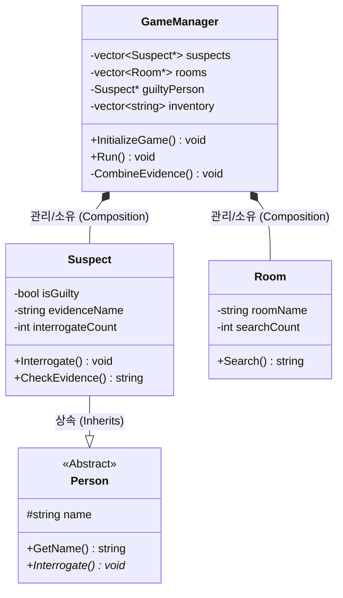

## 플레이 영상

[화면 녹화 중 2026-04-26 191410.mp4](attachment:98e22f9c-4f24-4183-851c-6c01c28fe3b8:화면_녹화_중_2026-04-26_191410.mp4)

**깃허브 주소 : [MissingDiamond](https://github.com/Femur-0607/MissingDiamond)**

## 주제

텍스트 기반 추리 게임을 제작했습니다.
스토리 및 대사는 AI를 사용하여 제작하였습니다.

## 목표

1. 과제에서 적용해야 할 필수 문법
    1. 클래스 정의
    2. 상속 시켜야 함
    3. vector 사용
2. 내용
    1. 블로그에 본인 프로젝트에 대한 설명(코드에 대한)
    2. * 트러블슈팅 기록 ** = 복습하면서, 구현하면서 오류 또는 이해가 어려웠던 부분

## 클래스 정의

- `GameManager` 클래스
    - 게임의 전반적인 흐름을 관리하는 클래스
    - 용의자 목록, 방 목록, 단서를 모을 인벤토리를 `vertor` 로 관리
        - 인벤토리의 경우 고정된 문자열(단서, 증거물)을 사용하기에 포인터를 사용하지 않음
    - `InitializeGame()` : 초기 게임 세팅 함수
    - `Run()` : 메인 게임 루프 함수
    - `CombineEvidence()` : 단서가 모이면 조합하는 함수
- `Person` 클래스
    - 게임에 등장하는 사람의 공통적인 속성을 묶어둔 부모 클래스
    - `name` 을 protected로 관리
    - 순수 가상 함수(`virtual void Interrogate() = 0;`)를 정의하여, 이후 상속받는 객체들이 반드시 심문 기능을 구현하도록 강제하는 인터페이스 역할을 함
- `Suspect` 클래스
    - `Person` 을 상속받은 용의자 클래스
    - 자신이 진범인지(`isGuilty`), 어떤 단서를 가졌는지(`evidenceName`), 몇 번 취조당했는지(`interrogateCount`) 등의 상태를 관리
    - `Interrogate()` : 취조 시 취조 횟수가 증가하며 랜덤한 대사가 나옴
    - `CheckEvidence()` : 일정 이상 취조 시 ‘심문 단서’를 반환
- `Room` 클래스
    - 플레이어가 단서를 찾기 위해 수색하는 공간
    - 방의 이름(`roomName`)과 현재까지 수색된 횟수(`searchCount`)를 관리
    - `Search()` : 수색 횟수가 특정 수치에 도달하면 ‘수색 단서’를 반환

## 코드 구현부

- main
    
    ```
    #include <iostream>
    #include <windows.h>
    #include "GameManager.h"
    
    using namespace std;
    
    int main() {
    	// 콘솔 창의 출력 인코딩을 UTF-8(65001)로 설정하여 한글 깨짐을 방지합니다.
    	SetConsoleOutputCP(CP_UTF8);
    
    	cout << "===========================================" << endl;
    	cout << "  저택의 사라진 다이아몬드 살인사건" << endl;
    	cout << "===========================================" << endl;
    	cout << "\n게임을 시작하려면 'enter'를 누르세요..." << endl;
    
    	system("pause > nul");
    
    	system("cls");
    
    	GameManager gm;
    	gm.Run();
    
    	return 0;
    }
    ```
    
- Suspect
    
    ```cpp
    #include "Suspect.h"
    #include <iostream>
    
    using namespace std;
    
    Suspect::Suspect(const string& name, bool guilty, const string& evidence)
        : Person(name), isGuilty(guilty), evidenceName(evidence), interrogateCount(0)
    {
        if (name == "집사") {
            dialogueList.push_back("전 평생을 회장님 곁에서 보냈습니다. 제가 왜 그런 짓을 하겠습니까?");
            dialogueList.push_back("아이쿠... 눈이 침침하군요. 제 금테 안경을 혹시 못 보셨습니까?");
        }
        else if (name == "가정부") {
            dialogueList.push_back("전 그 시간에 지하실에서 빨래를 하고 있었어요. 정말이에요!");
            dialogueList.push_back("손을 베어서 손수건으로 감싸두었는데... 그게 어디로 갔을까요?");
        }
        else if (name == "정원사") {
            dialogueList.push_back("난 밤새 정원 창고에 있었소. 비가 와서 도구들을 정리하느라 바빴지.");
            dialogueList.push_back("장미 가시 때문에 장갑이 찢어졌지 뭐요. 그런데 한 쪽이 보이질 않네.");
        }
    }
    
    // 2. 취조 기능
    void Suspect::Interrogate() {
        interrogateCount++; // 취조 횟수 1 증가
        cout << "\n[" << name << " 심문 중... (현재 " << interrogateCount << "회)]" << endl;
    
        int randomIndex = rand() % dialogueList.size();
    
        cout << name << " : \"" << dialogueList[randomIndex] << "\"" << endl;
    }
    
    // 3. 단서 획득 체크 로직
    string Suspect::CheckEvidence() {
        // 취조를 2회 했을 때, 진범이라면'심문 단서'를 줍니다.
        if (interrogateCount == 2 && isGuilty) {
            return name + " 심문 단서";
        }
    
        return "";
    }
    ```
    
- GameManager
    
    ```cpp
    #include "GameManager.h"
    #include <iostream>
    #include <cstdlib>
    #include <ctime>
    #include <algorithm>
    
    using namespace std;
    
    GameManager::GameManager() : currentTurn(1) {
        // 현재 시간으로 시드 설정합니다.
        srand(static_cast<unsigned int>(time(NULL)));
        
        // 시드 설정 직후 첫 번째 숫자가 비슷하게 나오는 현상을 방지합니다.
        for (int i = 0; i < 5; ++i) {
            rand();
        }
    }
    
    GameManager::~GameManager(){
    }
    
    void GameManager::InitializeGame() {
        // 1. 장소 생성
        rooms.push_back(new Room("주방"));
        rooms.push_back(new Room("거실"));
        rooms.push_back(new Room("회장님 집무실"));
    
        // 2. 용의자 생성 (3명 중 1명만 무작위 범인)
        int luckyNumber = rand() % 3;
        string evidenceList[] = { "깨진 안경테", "피 묻은 손수건", "찢어진 장갑" };
        
        suspects.push_back(new Suspect("집사", (luckyNumber == 0), evidenceList[0]));
        suspects.push_back(new Suspect("가정부", (luckyNumber == 1), evidenceList[1]));
        suspects.push_back(new Suspect("정원사", (luckyNumber == 2), evidenceList[2]));
        
        guiltyPerson = suspects[luckyNumber];
        
        // ================= [개발자 디버그 모드 추가] =================
        // 게임 시작 시 범인이 잘 바뀌는지 확인하기 위한 용도
        cout << "\n[DEBUG] 시스템: 이번 판의 진범은 [" << guiltyPerson->GetName() << "]입니다." << endl;
        cout << "[DEBUG] 증거품: " << guiltyPerson->GetEvidenceName() << endl;
        cout << "\n확인했으면 아무 키나 누르세요..." << endl;
        system("pause > nul"); 
        // ============================================================
    }
    
    void GameManager::ShowIntro() {
        system("cls");
        cout << "... 폭풍우가 치는 밤, '다이아몬드'가 사라졌습니다.";
        cout << "저택 안에는 3명의 용의자가 있습니다.";
        cout << "당신은 3일 안에 진범과 결정적 증거를 찾아야 합니다.";
    }
    
    void GameManager::Run() {
        InitializeGame();
        ShowIntro();
        
        while (currentTurn <= maxTurns) {
            system("cls");
            ShowStatus();
    
            int choice = 0;
            // 올바른 입력이 들어올 때까지 무한 반복
            while (true) {
                cout << "\n[행동 선택] 1. 심문  2. 수색" << endl;
                cout << "선택: ";
                
                // choice는 int값으로 char이 들어오면 false지만 !로 true가 되서 밑에 예외처리 실행
                if (!(cin >> choice)) {
                    cin.clear(); // 에러 플래그 초기화
                    cin.ignore(1000, '\n'); // 버퍼 비우기
                    cout << "숫자로 입력해주세요!" << endl;
                    continue;
                }
                
                // choice 입력값은 그대로 담아져 있어서 값을 비교함
                if (choice == 1 || choice == 2) break; // 1이나 2면 통과
                else cout << "잘못된 입력입니다. 1 또는 2를 선택하세요." << endl;
            }
    
            if (choice == 1) InterrogatePhase();
            else SearchPhase();
            
            CombineEvidence();
            
            auto it = find(inventory.begin(), inventory.end(), guiltyPerson->GetEvidenceName());
            if (it != inventory.end()) {
                cout << "\n[!] 모든 진실이 밝혀졌습니다. 범인을 지목하러 갑니다!" << endl;
                system("pause > nul");
                break;
            }
    
            currentTurn++;
            
            cout << "\n아무 키나 누르면 다음으로...";
            system("pause > nul");
        }
        
        FinalSelection();
        
        cout << "\n===========================================" << endl;
        cout << "게임을 종료하려면 아무 키나 누르세요..." << endl;
        system("pause > nul");;
    }
    
    void GameManager::ShowStatus() {
        // 1일차, 2일차, 3일차 계산
        int day = (currentTurn - 1) / 3 + 1;
        
        // 아침, 점심, 저녁 계산
        string timeOfDay;
        int phase = currentTurn % 3;
        if (phase == 1) timeOfDay = "아침";
        else if (phase == 2) timeOfDay = "점심";
        else timeOfDay = "저녁"; // 나머지가 0일 때
        
        cout << "-------------------------------------------" << endl;
        cout << " 현재 시간: " << day << "일차 (" << timeOfDay << ")" << endl;
        cout << " 인벤토리: ";
        if (inventory.empty()) cout << "비어 있음";
        for (const string& item : inventory) cout << "[" << item << "] ";
        cout << "\n-------------------------------------------" << endl;
    }
    
    // 심문 기능
    void GameManager::InterrogatePhase() {
        cout << "\n누구를 심문하시겠습니까?" << endl;
        for (int i = 0; i < suspects.size(); ++i) {
            cout << i + 1 << ". " << suspects[i]->GetName() << "  ";
        }
        
        int target;
        cin >> target;
        if (target >= 1 && target <= suspects.size()) {
            suspects[target - 1]->Interrogate();
            
            // 심문 후 증거 획득 조건 체크
            string item = suspects[target - 1]->CheckEvidence();
            if (!item.empty() && find(inventory.begin(), inventory.end(), item) == inventory.end()) {
                cout << "\n[!] " << suspects[target - 1]->GetName() << "에게서 [" << item << "]를 발견했습니다!" << endl;
                inventory.push_back(item);
            }
        }
    }
    
    void GameManager::SearchPhase() 
    {
        cout << "\n어디를 수색하시겠습니까?" << endl;
        for (int i = 0; i < rooms.size(); ++i) 
        {
            cout << i + 1 << ". " << rooms[i]->GetRoomName() << "  ";
        }
    
        int target;
        cin >> target;
        if (target >= 1 && target <= rooms.size())
        {
            string item = rooms[target - 1]->Search();
        
            if (!item.empty() && find(inventory.begin(), inventory.end(), item) == inventory.end())
            {
                cout << "\n[!] " << rooms[target - 1]->GetRoomName() << "에서 [" << item << "]를 발견했습니다!" << endl;
                inventory.push_back(item);
            }
        }
    }
    
    void GameManager::FinalSelection()
    {
        system("cls");
        cout << "===========================================" << endl;
        cout << "              최종 지목의 시간             " << endl;
        cout << "===========================================" << endl;
        cout << "3일의 시간이 모두 지났습니다." << endl;
        cout << "당신이 생각하는 진범은 누구입니까?\n" << endl;
        
        // 1. 용의자 목록 보여주기
        for (int i = 0; i < suspects.size(); ++i) {
            cout << i + 1 << ". " << suspects[i]->GetName() << endl;
        }
        
        int choice = 0;
        while (true) {
            cout << "\n범인 선택 (번호 입력): ";
            if (!(cin >> choice)) {
                cin.clear(); cin.ignore(1000, '\n');
                continue;
            }
            if (choice >= 1 && choice <= suspects.size()) break;
            cout << "존재하지 않는 번호입니다!" << endl;
        }
        
        // 2. 결과 판정하기
        if (choice >= 1 && choice <= suspects.size()) {
            Suspect* picked = suspects[choice - 1];
            
            system("cls");
            cout << "...당신은 " << picked->GetName() << "을(를) 진범으로 지목했습니다." << endl;
            
            if (picked->IsGuilty()) {
                cout << "\n[정답!] " << picked->GetName() << "이(가) 진짜 범인이었습니다!" << endl;
                cout << "사건을 무사히 해결했습니다! (승리)" << endl;
            } else {
                cout << "\n[오답!] " << picked->GetName() << "은(는) 범인이 아니었습니다..." << endl;
                cout << "진범은 유유히 빠져나갔습니다. (패배)" << endl;
            }
        } else {
            cout << "잘못된 선택입니다. 진범을 놓쳤습니다! (패배)" << endl;
        }
    }
        
    void GameManager::CombineEvidence()
    {
        string targetEvidence = guiltyPerson->GetEvidenceName();
        
        int interrogateCount = 0;
        int searchCount = 0;
    
        for (const string& item : inventory) {
            // string::npos는 "그런 단어 못 찾았음!"이라는 뜻입니다.
            // 즉, npos가 아니라는 건 단어를 성공적으로 찾았다는 뜻입니다.
            if (item.find("심문 단서") != string::npos) interrogateCount++;
            if (item.find("수색 단서") != string::npos) searchCount++;
        }
    
        // 심문 단서 1개, 수색 단서 1개 이상 모이면 조합
        if (interrogateCount >= 1 && searchCount >= 1) {
            cout << "\n===========================================" << endl;
            cout << " [추리 시작] 흩어진 정보들이 하나로 모입니다..." << endl;
        
            // 범인에 따른 추리 대사
            if (targetEvidence == "깨진 안경테") {
                cout << " '안경을 잃어버렸다'는 집사의 말과 수색 중 발견한 유리 조각..." << endl;
            } 
            else if (targetEvidence == "피 묻은 손수건") {
                cout << " 가정부의 다친 손과 현장에 떨어진 천 조각의 무늬가 일치합니다!" << endl;
            }
            else if (targetEvidence == "찢어진 장갑") {
                cout << " 정원사가 잃어버렸다던 장갑 한 쪽이 여기서 발견되는군요." << endl;
            }
    
            cout << " [!] 결정적 증거 [" << targetEvidence << "]를 확보했습니다!" << endl;
            cout << "===========================================\n" << endl;
        
            inventory.push_back(targetEvidence);
        }
    }
    ```
    

## 트러블 슈팅

- LNK2001
    - **문제상황**
        1. 부모 클래스(`Person`)에 `virtual void Interrogate();`라고 가상 함수를 선언만 해두고, 자식 클래스(`Suspect`)에서 세부 구현을 작성함.
        2. 빌드 시 `LNK2001: 확인할 수 없는 외부 기호` 에러가 발생하며 컴파일이 실패함.
    - **원인 분석**
        1. 기존에 사용하던 **C#의 추상 메서드(`abstract`) 개념을 C++에 그대로 적용하려 했던 것이 원인**이었음.
        2. C++의 링커(Linker)는 가상 함수에 `= 0`이 없으면 해당 함수의 구현부(`{}`)가 어딘가에 반드시 존재한다고 간주하고 찾게 됨. 부모 클래스에 선언만 하고 알맹이를 비워두었기 때문에 링커가 이를 찾지 못해 에러를 뿜어낸 것임.
            1. https://euna501.tistory.com/entry/LNK2001-%EC%99%B8%EB%B6%80-%EA%B8%B0%ED%98%B8%EB%A5%BC-%ED%99%95%EC%9D%B8%ED%95%A0-%EC%88%98-%EC%97%86%EC%8A%B5%EB%8B%88%EB%8B%A4-virtual-%ED%95%A8%EC%88%98-%EC%82%AC%EC%9A%A9
    - **해결 방안**
        1. C++에서 자식에게 구현을 강제하는 '인터페이스' 역할을 하려면 **순수 가상 함수(Pure Virtual Function)**를 사용해야 함
            1. https://wn42.tistory.com/114
        2. 부모 클래스의 함수 선언을 `virtual void Interrogate() = 0;`으로 수정하여, 컴파일러에게 "이 함수는 부모가 구현하지 않으니 자식 클래스가 무조건 오버라이딩해야 한다"는 의도를 명확히 전달함
    - **결과 및 깨달음**
        - 링크 에러가 말끔히 해결됨
        - C#의 `abstract` 키워드가 C++의 `= 0` 문법과 정확히 동일한 역할을 한다는 것을 이해
- **`cin` 무한 루프**
    - **문제 상황**
        - GM::RUN()행동 선택 메뉴(`1. 심문 2. 수색`)에서 `cin >> choice;`로 정수를 입력받을 때, 실수로 영단어나 문자(예: 'a')를 입력하면 화면에 "숫자로 입력해주세요!"라는 경고문이 무한정 출력되며 프로그램이 먹통(무한 루프)이 되는 버그가 발생함.
        - `cin.clear()`를 사용해 에러 상태를 초기화해주었음에도 루프를 빠져나오지 못함.
    - **원인 분석**
        - 이 현상의 원인을 제미나이에게 질문하고 토론하며 '**입력 버퍼(Input Buffer)**'라는 C++의 동작 원리를 알게 됨.
        - 사용자가 잘못 입력한 문자 데이터("a\n")는 `cin`에서 에러를 뱉어낸 뒤에도 사라지지 않고 입력 버퍼(컨베이어 벨트)에 그대로 남아있음.
        - `cin.clear()`로 에러 파업 상태만 풀었을 뿐, 버퍼에 남은 쓰레기 데이터를 치우지 않았기 때문에 다음 루프에서 컴퓨터가 또다시 잔류 데이터('a')를 읽어 들이고 에러를 발생시키는 과정이 무한 반복된 것임.
    - **해결 방안**
        - 에러 플래그 초기화 직후에 **`cin.ignore(1000, '\n');`** 코드를 추가함.
        - 이 코드를 통해 입력 버퍼 내부에 남아있는 최대 1000개의 문자를 엔터키(`\n`)가 나올 때까지 모조리 비워내어(Flush), 다음 입력을 아주 깨끗한 백지상태에서 받을 수 있도록 방어적 프로그래밍을 적용함.
    - **결과 및 깨달음**
        - 문자를 입력해도 경고문이 딱 한 번만 출력되고, 정상적으로 다음 입력을 대기하게 됨.
        - 사용자의 입력은 언제든 예측을 벗어날 수 있으므로, 입출력을 다룰 때는 반드시 **상태 초기화(`clear`)와 잔여 데이터 청소(`ignore`)가 한 세트로 이루어져야 함**을 배움.
- `Contains` 찾아보기
    
    C#에서  문자열(`string`)이나 컬렉션(`List`, `Array` 등)에서 특정 요소나 부분 문자열의 포함 여부를 `bool`로 반환하는 메서드
    
    
    
- `windows.h`와 `std` 네임스페이스 충돌
    - **문제 상황**
        - 코드 내에 `windows.h`를 포함(Include)하고, 전역 범위에서 `using namespace std;`를 선언한 상태로 빌드했을 때 컴파일 에러가 발생함.
        - `byte`와 같은 식별자가 중복 정의되었다는 '모호한 기호(Ambiguous symbol)' 에러가 발생하며 프로그램이 실행되지 않음.
    - **원인 분석**
        - `windows.h` 내부에 정의된 Windows API용 타입(예: `byte`)과 C++ 표준 라이브러리의 `std::byte`가 이름이 같아서 발생한 **네임스페이스 충돌(Namespace Collision)**이 원인이었음.
        
        
        
    - **💡 해결 방안**
        - `windows.h`의 포함 범위를 전체 헤더가 아닌, 꼭 필요한 기능이 있는 `.cpp` 파일 내부로 최소화함
        - 필요한 경우 `using namespace std;` 대신 `std::cout`, `std::vector`처럼 필요한 기능만 호출하거나, 범위를 한정하여 사용
    - **✅ 결과 및 깨달음**
        - 식별자 충돌이 해결되어 컴파일이 정상적으로 완료됨.
        - 편의를 위해 무심코 사용하던 `using namespace std;`가 외부 라이브러리(`windows.h` 등)와 결합할 때 치명적인 충돌을 일으킬 수 있음을 뼈저리게 깨달음. 이후 프로젝트부터는 **안전한 헤더 관리와 네임스페이스 사용 규칙**을 엄격히 지키게 됨.
- `rand()` 사용시 초기 난수 고정 현상
    - **문제 상황**
        - 매 게임마다 무작위로 진범이 바뀌어야 함에도 불구하고, 프로그램을 짧은 간격으로 재실행할 때 특정 인물(예: 정원사)이 반복적으로 범인으로 고정되는 현상이 발생함
    - **🔍 원인 분석**
        - C++의 기본 난수 생성 함수인 `rand()`가 내부적으로 가지는 한계점인 **'초기 난수 편향(Initial Bias)'** 현상 때문이었음.
        - https://blockdmask.tistory.com/308
    - **💡 해결 방안**
        - 위 블로그에 있던 랜덤함수 구현 예제 활용
    - **✅ 결과 및 깨달음**
        - 짧은 간격으로 게임을 여러 번 재실행해도 진범이 매 판  무작위로 정상 변경되는 것을 확인
        - 함수의 겉보기 동작만 믿지 않고 내부 알고리즘의 한계를 의심하여 문제를 해결하는 경험을 함. 향후  `rand()` 대신 **C++11 이후 도입된 C++의 `<random>` 을 사용해봐야겠다 생각함


